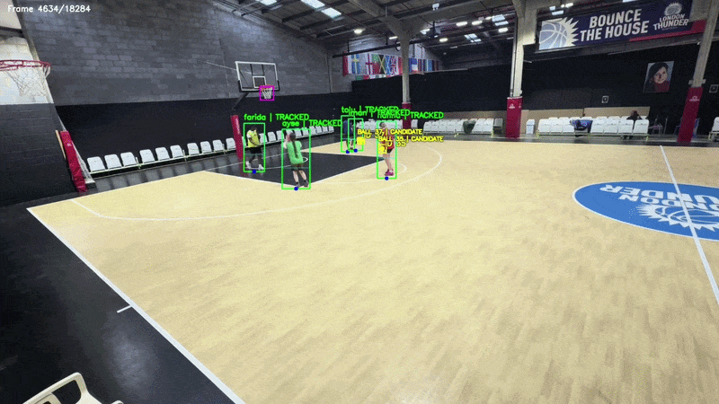
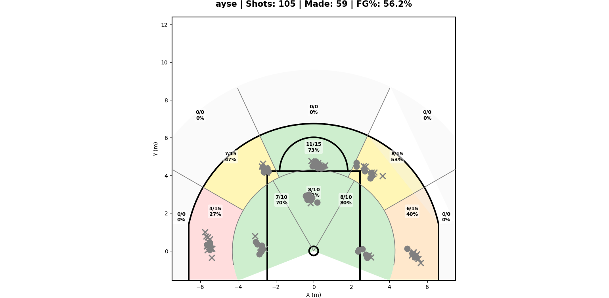
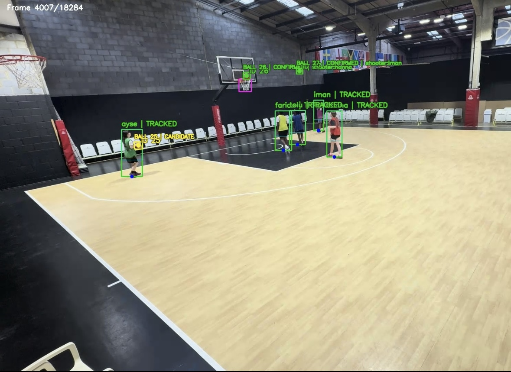

# AI Basketball Analysis System

An AI-powered basketball analytics system designed to analyse real-world basketball training sessions using computer vision and spatial analytics.

The project combines player detection, multiple basketball tracking, court mapping, and shot analysis to generate performance insights for coaches and players in dynamic multi-player environments.

---

# Overview

Many existing basketball analytics systems are designed for simplified environments, typically focusing on tracking a single player or a single basketball.

At the professional level, some advanced systems do exist, but they often require expensive multi-camera setups, specialised hardware, and sensor-based tracking technologies that are not accessible for most grassroots basketball environments.

However, real basketball training sessions are significantly more dynamic, with multiple players and multiple basketballs moving simultaneously on the court.

This project was designed to address that challenge by providing an accessible AI-powered analytics solution capable of analysing player performance during real basketball training sessions using only a single camera setup.

The system is currently being developed and used through real basketball training sessions in London.

---

# Key Features

## Detection

### Multi-player Detection
The system is capable of detecting and tracking multiple players simultaneously during dynamic basketball training sessions.

### Basketball Tracking
Custom basketball tracking logic is used to track multiple basketballs during dynamic multi-player basketball training sessions.

---

## Analytics

### Shot Detection
The system identifies shot attempts during training sessions using ball trajectory and event-based analysis.

## Make / Miss Detection — Net Motion Analysis

Shot outcomes are analysed to classify made and missed shots during training activities.
The make/miss classifier uses two independent verification signals:

1. **Spatial trajectory analysis** — evaluates the ball path relative to the rim center
2. **Net motion analysis** — measures pixel-level movement inside the net region after the ball passes the rim plane

A shot is classified as **MAKE** only if both conditions are satisfied.

This dual-validation approach reduces false positives that can occur in single-camera basketball analysis systems, where the ball appearing near or above the rim does not necessarily mean the shot was made.

Due to camera perspective and depth limitations, trajectory-based analysis alone may incorrectly classify some shots during shooting drills and practice scenarios. To improve robustness, the system combines ball trajectory analysis with net motion verification to confirm that the ball actually passed through the basket.

The system performs frame-difference motion analysis inside a dedicated net ROI (Region of Interest). The ball bounding box is excluded from the motion calculation to ensure that only net deformation contributes to the motion score.

This approach has been validated through real basketball training sessions in London.

### Shooter Assignment
Custom shooter assignment logic is used to associate shot attempts with the correct player in multi-player environments.

---

## Spatial Analysis

### Court Mapping
Homography-based court mapping is used to transform video coordinates into real basketball court positions.

### Shot Zones
The system categorises shots into different court zones for performance evaluation and shot selection analysis.

### Spatial Analytics
Spatial shooting analysis is generated to help evaluate player tendencies and shooting efficiency across different areas of the court.

---

## Visualisation

### Shot Charts
The system generates basketball shot charts to visualise shooting locations and performance trends.

### Visual Overlays
Visual overlays are used to display detections, tracking information, and analytics directly on video frames.

---

# Example Outputs

## Shot Chart Analysis

Example shot chart generated from a real basketball training session.

The system generates zone-based shooting analytics and performance visualisations to support player development and coaching analysis.

---

## Detection & Tracking

Example frame demonstrating multi-player detection, basketball tracking, and visual overlays during a real basketball training session.

---

# System Architecture

The system combines computer vision, object tracking, and spatial analysis techniques to process real basketball training sessions captured using a single-camera setup.

Video frames are analysed to identify players, track basketball movement, associate shot attempts with players, and generate spatial shooting analytics.

The project is designed to operate in dynamic multi-player training environments where multiple players and multiple basketballs may appear simultaneously on the court.

---

# Real-World Application

The system is currently being used and developed through real basketball training sessions in London.

The project is being used to analyse shooting performance, generate shot charts, and support player development in grassroots basketball environments.

The analytics generated by the system are designed to help coaches better understand player strengths, weaknesses, shooting tendencies, and long-term performance development.

---

# Ongoing Development

The project is currently under active development, with ongoing work focused on improving system performance, scalability, and processing capabilities in complex basketball training environments.

Current development areas include:

- Improving player detection performance in challenging training conditions
- Optimising processing speed to move closer towards real-time analysis
- Expanding the range of basketball performance statistics and analytics generated by the system

New features and system improvements are continuously being tested and refined through real basketball training sessions.

---

# Commercial Development

The project is currently being developed as an AI-powered sports analytics solution for grassroots basketball environments.

The system is currently being used and commercially deployed across multiple grassroots basketball clubs in London as part of ongoing real-world development.

Due to ongoing commercial development, selected implementation details, trained models, and proprietary analytics logic are intentionally kept private.

---

# Disclaimer

This repository contains selected demonstration components and documentation of the project.

Some production-level modules, datasets, trained weights, and internal analytics logic are excluded from the public repository.
