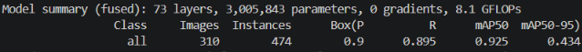

AI Basketball Analysis System

An AI-powered basketball analytics system designed to analyse real-world basketball training sessions using computer vision and spatial analytics.

The project combines player detection, multiple basketball tracking, court mapping, and shot analysis to generate performance insights for coaches and players in dynamic multi-player environments.

Overview

Many existing basketball analytics systems are designed for simplified environments, typically focusing on tracking a single player or a single basketball.

At the professional level, some advanced systems do exist, but they often require expensive multi-camera setups, specialised hardware, and sensor-based tracking technologies that are not accessible for most grassroots basketball environments.

However, real basketball training sessions are significantly more dynamic, with multiple players and multiple basketballs moving simultaneously on the court.

This project was designed to address that challenge by providing an accessible AI-powered analytics solution capable of analysing player performance during real basketball training sessions using only a single camera setup.

The system is currently being developed and used through real basketball training sessions in London.

Key Features

Detection

Multi-player Detection

The system detects and tracks multiple players simultaneously during dynamic
basketball training sessions. To keep players reliably distinguished in a busy,
fast-moving scene, it uses coloured training bibs as a per-player identifier.
Distinctly coloured bibs are already standard equipment at most clubs, and where
they are not, they are inexpensive to obtain. Using bib colour as an identity cue
makes simultaneous multi-player detection and tracking substantially more
reliable, helping the system maintain each player's identity even when players
cross paths or partially occlude one another.

Custom-Trained Ball Detection Model

Rather than relying on a generic, off-the-shelf object detector, the system uses a
basketball detection model trained from scratch on a dataset built specifically
for this project.

Dataset

1,550 images, personally collected and manually labelled
Spanning real gym conditions: varied lighting, different player densities,
partial occlusions, and changing ball visibility
Built through an iterative pipeline — collect → label → train → evaluate →
refine — across multiple cycles, with targeted examples added after each round
to address the model's remaining failure cases

Model

Architecture: YOLOv8n (Ultralytics) — a deliberately lightweight, fused
network of 73 layers, ~3.0M parameters, and 8.1 GFLOPs, so it runs efficiently
without specialised hardware
Train / validation split: 80 / 20

Validation results (held-out set: 310 images, 474 labelled ball instances)

MetricValuePrecision0.90Recall0.895mAP@0.50.925mAP@0.5:0.950.434

<h3>Basketball Detection Model Performance</h3>

These results reflect performance on real, varied training footage rather than a
clean benchmark.

Basketball Tracking

Custom basketball tracking logic tracks multiple basketballs simultaneously
throughout dynamic, multi-player training sessions. Detection is driven by the
custom-trained YOLOv8n model described above, which keeps ball detection
reliable under real gym conditions — varied lighting, multiple players in frame,
and changing ball visibility. Each detected ball is followed frame to frame, and
the system continuously reconstructs each ball's trajectory — its path of
motion across frames — rather than treating detections as isolated points. This
trajectory information allows several balls to be tracked at once through the
crowded, fast-moving motion of real training without confusing one ball for
another, and forms the basis for downstream shot detection and shot-outcome
analysis.

Analytics

Shot Detection

The system identifies shot attempts during training sessions using ball trajectory and event-based analysis.

Make / Miss Detection — Net Motion Analysis

Show Image

Shot outcomes are analysed to classify made and missed shots during training activities.
The make/miss classifier uses two independent verification signals:

Spatial trajectory analysis — evaluates the ball path relative to the rim center
Net motion analysis — measures pixel-level movement inside the net region after the ball passes the rim plane

A shot is classified as MAKE only if both conditions are satisfied.

This dual-validation approach reduces false positives that can occur in single-camera basketball analysis systems, where the ball appearing near or above the rim does not necessarily mean the shot was made.

Due to camera perspective and depth limitations, trajectory-based analysis alone may incorrectly classify some shots during shooting drills and practice scenarios. To improve robustness, the system combines ball trajectory analysis with net motion verification to confirm that the ball actually passed through the basket.

The system performs frame-difference motion analysis inside a dedicated net ROI (Region of Interest). The ball bounding box is excluded from the motion calculation to ensure that only net deformation contributes to the motion score.

This approach has been validated through real basketball training sessions in London.

Shooter Assignment

Custom shooter assignment logic is used to associate shot attempts with the correct player in multi-player environments.

Spatial Analysis

Court Mapping

Homography-based court mapping is used to transform video coordinates into real basketball court positions.

Shot Zones

The system categorises shots into different court zones for performance evaluation and shot selection analysis.

Spatial Analytics

Spatial shooting analysis is generated to help evaluate player tendencies and shooting efficiency across different areas of the court.

Visualisation

Shot Charts

The system generates basketball shot charts to visualise shooting locations and performance trends.

Visual Overlays

Visual overlays are used to display detections, tracking information, and analytics directly on video frames.

Example Outputs

Shot Chart Analysis

Show Image

Example shot chart generated from a real basketball training session.

The system generates zone-based shooting analytics and performance visualisations to support player development and coaching analysis.

Detection & Tracking

Show Image

Example frame demonstrating multi-player detection, basketball tracking, and visual overlays during a real basketball training session.

System Initialisation

Before processing begins, the system performs a structured interactive calibration sequence. All inputs are provided through an OpenCV GUI at runtime — no configuration files are required.

Step 1 — Player Registration

The user specifies the number of players to track. For each player, a name is entered via terminal input.

The user then draws a bounding box around each player on the first video frame using cv2.selectROI. This provides the initial spatial position for each player track.

Step 2 — Bib (Jersey) Colour Reference

For each registered player, the user navigates to a suitable frame using keyboard controls (N / B to jump forward or backward by 50 frames) and draws a bounding box around the player's jersey.

The system extracts an HSV colour reference from this region, computing a circular mean hue and a normalised colour histogram. This reference is used throughout the video to re-identify each player using colour-weighted assignment scoring.

Step 3 — Rim Calibration

The user clicks two points on the target rim in the first video frame to define the rim line. The rim centre is computed as the midpoint and is used as the spatial anchor for shot detection, ball trajectory analysis, and near-rim tracking behaviour.

Manual rim input is required because indoor sports facilities in the UK commonly have multiple basketball hoops visible within a single camera frame. Automatic rim detection cannot reliably distinguish the target hoop from the side hoops in these environments.

Step 4 — Net ROI Selection

The user specifies the net height by clicking a single point on the net region. The system automatically computes the net bounding box from this input, combined with the previously defined rim centre and rim line geometry. This region is used exclusively for net motion analysis during make/miss classification. The ball bounding box is dynamically excluded from this region during motion computation to prevent false motion readings caused by the ball itself.
Manual net height input is required for the same reason as rim calibration. With multiple hoops visible in the frame, automatic net detection cannot reliably isolate the correct net region from a single camera view.

Step 5 — Court Homography Calibration

The user provides five spatial references to compute a perspective homography mapping image pixels to real-world court coordinates (metres):

2 point clicks — left elbow and right elbow (lane corners at the free-throw line)
3 line drawings — left sideline, right sideline, and baseline (two clicks per line)

Manual calibration is required because automatic court detection is not reliable in UK indoor sports facilities, where courts share floor space with multiple other sports. Standard court detection algorithms trained on clean basketball markings fail in these environments due to the high density of overlapping lines from different sports.

The baseline corner points are not clicked directly. In single-camera setups, the far baseline corners are typically at the edge of the frame or partially occluded, making direct point selection inaccurate. Instead, the user draws the left sideline, right sideline, and baseline as independent lines. The system computes each baseline corner by analytically intersecting the corresponding sideline and baseline vectors, eliminating the positional error that would result from direct corner selection at distance.

The four resulting image points are matched against known real-world court coordinates using cv2.findHomography with an exact 4-point solve (no RANSAC). The resulting homography matrix H is used throughout processing to convert any image-space coordinate to a real court position in metres, which is then used for shot zone classification and shot chart generation.

Demo Video

Watch the full system demonstration here:

▶️ https://www.youtube.com/watch?v=tfaVmRRfAWo

System Architecture

The system combines computer vision, object tracking, and spatial analysis techniques to process real basketball training sessions captured using a single-camera setup.

Video frames are analysed to identify players, track basketball movement, associate shot attempts with players, and generate spatial shooting analytics.

The project is designed to operate in dynamic multi-player training environments where multiple players and multiple basketballs may appear simultaneously on the court.

Real-World Application

The system is currently being used and developed through real basketball training sessions in London.

The project is being used to analyse shooting performance, generate shot charts, and support player development in grassroots basketball environments.

The analytics generated by the system are designed to help coaches better understand player strengths, weaknesses, shooting tendencies, and long-term performance development.

Ongoing Development

The project is currently under active development, with ongoing work focused on improving system performance, scalability, and processing capabilities in complex basketball training environments.

Current development areas include:

Improving player detection performance in challenging training conditions
Optimising processing speed to move closer towards real-time analysis
Expanding the range of basketball performance statistics and analytics generated by the system

New features and system improvements are continuously being tested and refined through real basketball training sessions.

Commercial Development

The project is currently being developed as an AI-powered sports analytics solution for grassroots basketball environments.

The system is currently being used and commercially deployed across multiple grassroots basketball clubs in London as part of ongoing real-world development.

While selected architecture and calibration methods are documented here for
demonstration, the trained models, datasets, and certain proprietary analytics
components — including the shooter-assignment logic — are intentionally kept
private due to ongoing commercial development.

Disclaimer

This repository contains selected demonstration components and documentation of the project.

The trained weights, datasets, and certain internal analytics modules — including
the shooter-assignment logic — are excluded from the public repository, while
selected architecture and calibration details are shared here for demonstration.

License

Copyright © 2025–2026 Behshad Arabzadeh. All Rights Reserved.

This repository is provided for portfolio, demonstration, and evaluation purposes
only. You may view, clone, and reference the code for educational and
non-commercial purposes. Commercial use, redistribution, sublicensing, resale, or
deployment is prohibited without prior written permission.

See the full LICENSE for complete terms.

Author

Behshad Arabzadeh — Founder, Sportsvision AI Ltd

Designed, developed, and built end-to-end by the author.

GitHub: @behshadarabzadeh
